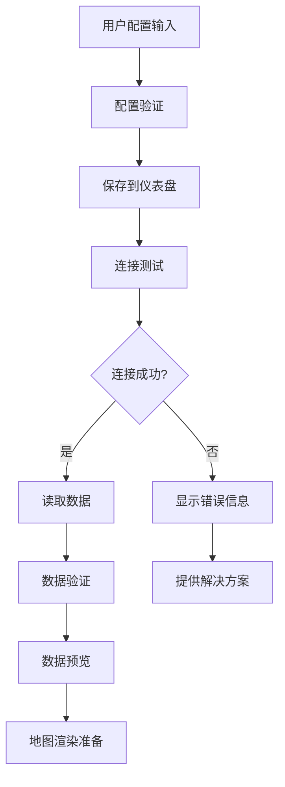

# 设计文档

## 概述

本设计文档描述了飞书插件与多维表格集成测试功能的技术实现方案。该功能将在现有的飞书中国地图插件基础上，增强多维表格数据读取、验证、预览和错误处理能力，确保插件能够稳定可靠地与飞书多维表格进行数据交互。

## 架构

### 整体架构

```
┌─────────────────┐    ┌─────────────────┐    ┌─────────────────┐
│   飞书仪表盘     │    │   插件前端界面   │    │   飞书多维表格   │
│                │    │                │    │                │
│ - 配置存储      │◄──►│ - 配置管理      │◄──►│ - 数据存储      │
│ - 插件容器      │    │ - 数据获取      │    │ - API 接口      │
│                │    │ - 状态展示      │    │                │
└─────────────────┘    └─────────────────┘    └─────────────────┘
                              │
                              ▼
                       ┌─────────────────┐
                       │   后端代理服务   │
                       │                │
                       │ - API 转发      │
                       │ - 认证处理      │
                       │ - 错误处理      │
                       └─────────────────┘
```

### 数据流架构



## 组件和接口

### 1. 配置管理模块 (ConfigManager)

**职责：** 处理多维表格连接配置的验证、保存和读取

**接口：**
```javascript
class ConfigManager {
  // 验证配置完整性
  validateConfig(config)
  
  // 保存配置到仪表盘
  async saveConfig(config)
  
  // 从仪表盘读取配置
  async loadConfig()
  
  // 获取配置模板
  getConfigTemplate()
}
```

**配置数据结构：**
```javascript
{
  title: string,           // 地图标题
  bitable: {
    appToken: string,      // 多维表格应用 Token
    tableId: string,       // 表格 ID
    viewId: string,        // 视图 ID
    accessToken?: string   // 访问令牌（可选）
  },
  dataMapping?: {          // 数据字段映射配置
    regionField: string,   // 地区字段名
    valueField: string     // 数值字段名
  }
}
```

### 2. 多维表格连接器 (BitableConnector)

**职责：** 处理与飞书多维表格的 API 交互

**接口：**
```javascript
class BitableConnector {
  // 测试连接
  async testConnection(config)
  
  // 获取表格记录
  async fetchRecords(config, options = {})
  
  // 获取表格结构信息
  async getTableSchema(config)
  
  // 处理 API 错误
  handleApiError(error)
}
```

**API 请求结构：**
```javascript
// 请求参数
{
  appToken: string,
  tableId: string,
  viewId: string,
  pageSize?: number,
  pageToken?: string
}

// 响应结构
{
  code: number,
  msg: string,
  data: {
    items: Array<Record>,
    hasMore: boolean,
    pageToken?: string,
    total?: number
  }
}
```

### 3. 数据验证器 (DataValidator)

**职责：** 验证从多维表格获取的数据格式和完整性

**接口：**
```javascript
class DataValidator {
  // 验证数据结构
  validateDataStructure(records)
  
  // 检查必需字段
  checkRequiredFields(records, mapping)
  
  // 验证地理位置数据
  validateGeographicData(records)
  
  // 生成数据质量报告
  generateDataQualityReport(records)
}
```

### 4. 状态管理器 (StatusManager)

**职责：** 管理插件的各种状态和用户反馈

**接口：**
```javascript
class StatusManager {
  // 设置连接状态
  setConnectionStatus(status, message)
  
  // 设置数据加载状态
  setDataLoadingStatus(isLoading, progress)
  
  // 显示错误信息
  showError(error, suggestions)
  
  // 显示成功信息
  showSuccess(message)
}
```

### 5. 数据预览器 (DataPreviewer)

**职责：** 在界面上展示多维表格数据的预览信息

**接口：**
```javascript
class DataPreviewer {
  // 渲染数据预览
  renderPreview(records, container)
  
  // 显示数据统计信息
  showDataStats(records)
  
  // 显示字段信息
  showFieldInfo(schema)
  
  // 清空预览内容
  clearPreview()
}
```

## 数据模型

### 配置数据模型
```javascript
interface BitableConfig {
  title: string;
  bitable: {
    appToken: string;
    tableId: string;
    viewId: string;
    accessToken?: string;
  };
  dataMapping?: {
    regionField: string;
    valueField: string;
  };
}
```

### 记录数据模型
```javascript
interface BitableRecord {
  record_id: string;
  fields: {
    [fieldName: string]: any;
  };
  created_time: number;
  last_modified_time: number;
}
```

### 状态数据模型
```javascript
interface ConnectionStatus {
  isConnected: boolean;
  isLoading: boolean;
  error?: {
    code: string;
    message: string;
    suggestions: string[];
  };
  lastTestTime?: number;
}

interface DataStatus {
  recordCount: number;
  isLoading: boolean;
  lastFetchTime?: number;
  dataQuality?: {
    validRecords: number;
    invalidRecords: number;
    missingFields: string[];
  };
}
```

## 错误处理

### 错误分类和处理策略

1. **配置错误**
   - 缺少必需配置项：提示用户补充
   - 配置格式错误：显示正确格式示例
   - 无效的 Token/ID：提供获取方法说明

2. **网络错误**
   - 连接超时：提供重试选项
   - 网络不可达：检查网络连接建议
   - API 限流：显示等待时间和重试建议

3. **API 错误**
   - 认证失败：检查 Token 有效性
   - 权限不足：提供权限配置指导
   - 资源不存在：验证 ID 正确性

4. **数据错误**
   - 数据格式不正确：显示期望格式
   - 必需字段缺失：列出缺失字段
   - 数据为空：提供数据添加建议

### 错误信息国际化
```javascript
const errorMessages = {
  'zh-CN': {
    MISSING_CONFIG: '缺少必需的配置信息',
    INVALID_TOKEN: 'Token 无效或已过期',
    NETWORK_ERROR: '网络连接失败，请检查网络设置',
    DATA_FORMAT_ERROR: '数据格式不正确，请检查表格结构'
  },
  'en-US': {
    MISSING_CONFIG: 'Missing required configuration',
    INVALID_TOKEN: 'Invalid or expired token',
    NETWORK_ERROR: 'Network connection failed',
    DATA_FORMAT_ERROR: 'Invalid data format'
  }
};
```

## 测试策略

### 单元测试
- 配置验证逻辑测试
- 数据解析和验证测试
- 错误处理逻辑测试
- 状态管理测试

### 集成测试
- 多维表格 API 集成测试
- 配置保存和读取测试
- 端到端数据流测试

### 用户测试场景
1. **正常流程测试**
   - 配置有效的多维表格连接
   - 成功读取和预览数据
   - 保存和恢复配置

2. **异常场景测试**
   - 无效配置处理
   - 网络异常处理
   - 空数据处理
   - API 错误处理

3. **边界条件测试**
   - 大量数据处理
   - 特殊字符处理
   - 并发请求处理

### 测试数据准备
- 创建测试用多维表格
- 准备各种数据格式样本
- 模拟各种错误场景
- 准备性能测试数据集